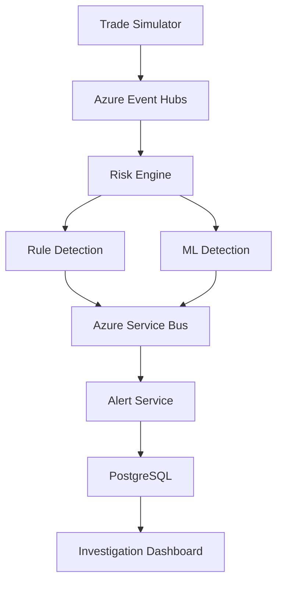

# TradeGuard MVP

## 1. Project overview

**TradeGuard** is a Python-based, cloud-native trade surveillance and risk-detection platform.

The MVP receives simulated trading events, processes them in real time, detects suspicious activity using predefined rules and a basic machine-learning model, generates alerts, and presents those alerts through an investigation dashboard.

## 2. MVP objective

The MVP must demonstrate the complete workflow:



## 3. MVP users

### Compliance analyst

* View generated alerts
* Filter alerts by severity and status
* Review suspicious trades
* Add investigation notes
* Update alert status
* Close an investigation

### Administrator

* Manage users
* Configure risk rules
* View system health
* Generate simulated trading data

## 4. MVP scope

### Included

* Simulated trading-event generation
* Real-time event ingestion
* Five rule-based risk detections
* Basic machine-learning anomaly detection
* Risk-score calculation
* Alert generation
* Alert investigation workflow
* Real-time dashboard
* Audit logs
* Azure deployment
* Automated testing
* CI/CD pipeline

### Not included in the first MVP

* Real-money trading
* Integration with a real stock exchange
* Automatic trade blocking
* Advanced deep-learning models
* Mobile application
* Multi-region deployment
* Full regulatory-report submission
* High-frequency trading performance
* Production-grade identity verification

## 5. Core features

### 5.1 Trade event simulator

Create a Python service that generates normal and suspicious trading activities.

Each event should contain:

```json
{
  "event_id": "018f4df8-a82d-7d40-9152-e6a6a8fc3581",
  "event_type": "ORDER_CREATED",
  "trader_id": "TRD-1001",
  "account_id": "ACC-2001",
  "instrument": "AAPL",
  "side": "BUY",
  "order_type": "LIMIT",
  "quantity": 100,
  "price": 210.50,
  "timestamp": "2026-07-26T10:30:00Z",
  "device_id": "DEVICE-501",
  "ip_address": "192.0.2.10",
  "country": "AU"
}
```

The simulator should generate:

* Normal orders
* Large orders
* Rapidly cancelled orders
* High-frequency orders
* Unusual trading-volume events
* New-device or location events

### 5.2 Trade ingestion service

Build with FastAPI and Pydantic.

Responsibilities:

* Receive trading events through an API
* Validate the event structure
* Assign an event ID
* Publish valid events to Azure Event Hubs
* Reject malformed events
* Prevent obvious duplicate submissions

Example endpoint:

```http
POST /api/v1/trade-events
```

### 5.3 Real-time event processing

The Risk Engine consumes events from Azure Event Hubs.

Responsibilities:

* Parse incoming events
* Apply configured risk rules
* Request anomaly scores
* Calculate the final risk score
* Produce alerts when thresholds are exceeded
* Record processing errors

## 6. MVP risk rules

### Rule 1: Large order

Generate an alert when:

```text
quantity × price >= 100,000
```

Default severity:

```text
HIGH
```

### Rule 2: Rapid cancellation

Generate an alert when a trader cancels at least 10 orders within five minutes.

Default severity:

```text
HIGH
```

### Rule 3: Excessive trading frequency

Generate an alert when a trader submits more than 30 orders within one minute.

Default severity:

```text
MEDIUM
```

### Rule 4: Unusual trading volume

Generate an alert when the current volume exceeds three times the trader’s historical average.

Default severity:

```text
MEDIUM
```

### Rule 5: New device and high-value order

Generate an alert when:

```text
New device = true
AND
Order value >= 50,000
```

Default severity:

```text
CRITICAL
```

All limits should be configurable through environment variables or database records.

## 7. Machine-learning component

Use an **Isolation Forest** model from Scikit-learn.

### Model inputs

* Order value
* Orders per minute
* Cancellation rate
* Current volume versus average volume
* Number of instruments traded
* Hour of activity
* New-device indicator

### Model output

```json
{
  "is_anomaly": true,
  "anomaly_score": 82.5,
  "model_version": "isolation-forest-v1"
}
```

### MVP ML process

1. Generate historical sample data.
2. Clean and transform data using Pandas.
3. Train an Isolation Forest model.
4. Save the model using `joblib`.
5. Load the model when the anomaly service starts.
6. Return an anomaly score for each feature set.
7. Store the model version with every alert.

The MVP should treat machine learning as an additional signal, not as the only reason for generating a critical alert.

## 8. Risk-score calculation

Use a score from 0 to 100.

```text
Final Risk Score =
Rule Score × 0.70 +
ML Anomaly Score × 0.30
```

| Risk score | Severity |
| ---------: | -------- |
|       0–29 | Low      |
|      30–59 | Medium   |
|      60–79 | High     |
|     80–100 | Critical |

## 9. Alert processing

The Risk Engine sends detected alerts to Azure Service Bus.

Example message:

```json
{
  "alert_id": "ALT-7001",
  "event_id": "018f4df8-a82d-7d40-9152-e6a6a8fc3581",
  "trader_id": "TRD-1001",
  "rule_code": "NEW_DEVICE_HIGH_VALUE",
  "title": "High-value order from new device",
  "severity": "CRITICAL",
  "risk_score": 91.4,
  "anomaly_score": 82.5,
  "detected_at": "2026-07-26T10:30:01Z"
}
```

Configure Service Bus with:

* Duplicate detection
* Message retry
* Dead-letter queue
* Unique `MessageId`
* Error monitoring

## 10. Investigation workflow

```text
NEW
  ↓
UNDER_REVIEW
  ↓
ESCALATED
  ↓
CONFIRMED or FALSE_POSITIVE
  ↓
CLOSED
```

An analyst must be able to:

* View alert details
* View the related trading event
* Assign the alert to themselves
* Add investigation notes
* Change its status
* Mark it confirmed or false positive
* Close the case

Every change must create an audit-log entry.

## 11. Dashboard

### Summary cards

* Events processed today
* Total open alerts
* Critical alerts
* High-risk traders
* Confirmed incidents
* Average processing time

### Charts

* Alerts by severity
* Alerts by risk rule
* Alerts over time
* Highest-risk traders
* Event-processing rate

### Alert table

Display:

* Alert ID
* Trader
* Instrument
* Rule
* Risk score
* Severity
* Status
* Detection time
* Assigned analyst

### Filters

* Date range
* Severity
* Alert status
* Trader
* Instrument
* Risk rule

## 12. Recommended architecture

| Component          | MVP technology                |
| ------------------ | ----------------------------- |
| Frontend           | Next.js and TypeScript        |
| APIs               | Python 3.12 and FastAPI       |
| Validation         | Pydantic                      |
| ORM                | SQLAlchemy                    |
| Migrations         | Alembic                       |
| Event streaming    | Azure Event Hubs              |
| Alert queue        | Azure Service Bus             |
| Database           | Azure Database for PostgreSQL |
| Machine learning   | Pandas and Scikit-learn       |
| Hosting            | Azure Container Apps          |
| Secrets            | Azure Key Vault               |
| Monitoring         | Application Insights          |
| Container registry | Azure Container Registry      |
| Infrastructure     | Terraform                     |
| CI/CD              | GitHub Actions                |
| Testing            | Pytest                        |

## 13. MVP services

```text
tradeguard-azure/
├── services/
│   ├── simulator/
│   ├── ingestion-service/
│   ├── risk-engine/
│   ├── anomaly-service/
│   ├── alert-service/
│   └── case-service/
├── frontend/
├── shared/
│   ├── schemas/
│   ├── event-contracts/
│   ├── database/
│   └── observability/
├── ml/
│   ├── datasets/
│   ├── training/
│   └── models/
├── infrastructure/
│   └── terraform/
├── tests/
├── docker-compose.yml
├── .env.example
└── README.md
```

For the first implementation, `alert-service` and `case-service` can be one FastAPI application. Separating them later prevents unnecessary MVP complexity.

## 14. Essential database tables

### `traders`

```text
id
external_reference
name
risk_level
created_at
```

### `trading_accounts`

```text
id
trader_id
account_number
status
base_currency
created_at
```

### `trade_events`

```text
id
event_id
event_type
trader_id
account_id
instrument
side
quantity
price
device_id
ip_address
country
event_timestamp
received_at
```

### `risk_rules`

```text
id
code
name
description
threshold
severity
enabled
updated_at
```

### `alerts`

```text
id
alert_id
event_id
trader_id
rule_code
title
description
rule_score
anomaly_score
final_risk_score
severity
status
assigned_to
detected_at
closed_at
```

### `case_notes`

```text
id
alert_id
author_id
note
created_at
```

### `audit_logs`

```text
id
user_id
entity_type
entity_id
action
old_value
new_value
created_at
```

## 15. Main API endpoints

### Events

```http
POST /api/v1/trade-events
GET  /api/v1/trade-events/{event_id}
```

### Alerts

```http
GET   /api/v1/alerts
GET   /api/v1/alerts/{alert_id}
PATCH /api/v1/alerts/{alert_id}/status
PATCH /api/v1/alerts/{alert_id}/assign
```

### Investigation notes

```http
GET  /api/v1/alerts/{alert_id}/notes
POST /api/v1/alerts/{alert_id}/notes
```

### Risk rules

```http
GET   /api/v1/risk-rules
PATCH /api/v1/risk-rules/{rule_id}
```

### Dashboard

```http
GET /api/v1/dashboard/summary
GET /api/v1/dashboard/alert-trends
GET /api/v1/dashboard/high-risk-traders
```

### Simulation

```http
POST /api/v1/simulation/start
POST /api/v1/simulation/stop
POST /api/v1/simulation/scenario
```

## 16. Security requirements

* Authenticate users through Microsoft Entra ID
* Implement analyst and administrator roles
* Store secrets in Azure Key Vault
* Use managed identities between Azure services
* Validate all API requests with Pydantic
* Record important user actions
* Avoid logging access tokens or sensitive data
* Apply API rate limiting
* Use HTTPS exclusively
* Restrict PostgreSQL and messaging-service access

## 17. Testing requirements

### Unit tests

* Risk-rule calculations
* Severity mapping
* Risk-score calculation
* Pydantic validation
* Anomaly-score transformation

### Integration tests

* Event Hubs producer and consumer
* Service Bus producer and consumer
* Database operations
* Alert creation
* Investigation updates

### Important test scenarios

* Duplicate event
* Malformed event
* Large order
* Rapid cancellation
* Service Bus retry
* Dead-letter message
* Database failure
* ML service unavailable
* Multiple alerts for one trader

Target:

```text
Minimum test coverage: 80%
```

## 18. Implementation schedule

| Week | Deliverable                                               |
| ---- | --------------------------------------------------------- |
| 1    | Repository, architecture, database and Docker environment |
| 2    | Event simulator and ingestion API                         |
| 3    | Event Hubs integration and risk-rule engine               |
| 4    | Service Bus integration and alert service                 |
| 5    | ML model and anomaly service                              |
| 6    | Investigation APIs and dashboard                          |
| 7    | Azure deployment, Terraform and CI/CD                     |
| 8    | Testing, monitoring, documentation and demonstration      |

## 19. MVP acceptance criteria

The MVP is complete when:

* The simulator generates normal and suspicious events.
* Valid events are published to Event Hubs.
* The Risk Engine processes events automatically.
* All five risk rules work correctly.
* The ML model returns anomaly scores.
* Risk scores and severity levels are calculated.
* Alerts are delivered through Service Bus.
* Duplicate alerts are handled safely.
* Alerts are stored in PostgreSQL.
* Analysts can investigate and close alerts.
* Dashboard statistics update successfully.
* Audit logs record investigation activities.
* Services run locally with Docker Compose.
* The application is deployed to Azure.
* GitHub Actions runs tests and deployment.
* Application Insights displays logs and errors.

## 20. Final MVP demonstration

Your portfolio demonstration should show:

1. Start the trading simulator.
2. Send normal trading events.
3. Show that normal events do not create critical alerts.
4. Generate a high-value order from a new device.
5. Show Event Hubs receiving the event.
6. Show the Risk Engine calculating its score.
7. Show the alert travelling through Service Bus.
8. Open the alert in the dashboard.
9. Assign it to an analyst.
10. Add a note and mark it as confirmed.
11. Show the audit trail.
12. Show logs and performance metrics in Application Insights.
